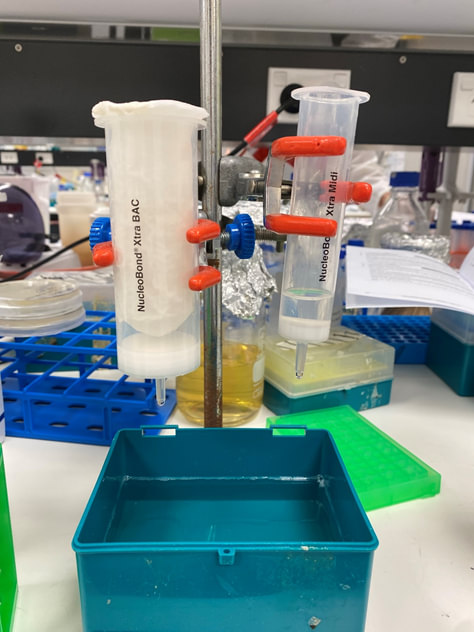

# BAC and Midi purification kits (Macherey-Nagel)

_This is a protocol for purifying large DNA constructs (>50 kb) from E. coli using BAC and Midi purification kits from Macherey-Nagel._

__Protocol by:__ Hung En Lai, 09/04/2020

## Reagents
- [Xtra BAC kit](https://www.mn-net.com/bioanalysis/kits/plasmid-dna/5136/nucleobond-xtra-bac-kit-for-large-construct-plasmid-dna?c=3889)

- [Xtra Midi kit](https://www.mn-net.com/bioanalysis/kits/plasmid-dna/5122/nucleobond-xtra-midi-kit-for-transfection-grade-plasmid-dna?c=3889)

- Isopropanol
- 70% Ethanol
- TE buffer or MQ water for DNA resolubilisation

## Equipments
- Clamps and stand for columns
- Waste tray for buffers
- Vortex
- Eppendorf centrifuge for pelleting large volume cultures (>500 mL)
- Microcentrifuge to pellet DNA after isopropanol precipitation
- water bath at 60 oC for keeping ELU buffer warm prior to eluting DNA from column

## Notes on culture volume
Macherey-Nagel (MN) recommends adhering to 1500 ODV of cell mass per BAC column, and the volumes of buffers in the protocol were determined based on this cell mass to ensure efficient extraction and purification of DNA. The required ODV for sufficient DNA yield depends on plasmid copy number, with low copy plasmids requiring higher ODV. Otherwise DNA pellet may not be visible due to poor yield.

ODV is obtained by multiplying OD600 value and volume of culture in mL. For example, if OD600 of overnight cell culture is determined to be 3.0 (dilute 1/10 before measuring to ensure reading is within linear range of absorbance calibration curve), 500 mL of cell culture at OD600 = 3 would give ODV1500, which is approximately 2.8 g wet cell mass. Pellet can be frozen at -20 oC for storage, or subjected to purification directly.

## Protocol steps

| Step                                     | BAC column      | Midi column (low-copy protocol x2 vol) |
|------------------------------------------|:-----------------:|:---------------------------------------:|
| 1. Resuspension pellet with RES buffer (added RNase)  | 60 mL           | 32 mL                                  |
| 2. Lyse cell with LYS buffer (with lyseblue). Invert 5 times to mix. Incubate 5 min at r.t.  | 60 mL           | 32 mL                               |
| 3. In the meanwhile equilibrate column with EQU buffer. Add buffer to the rim of filter unit in circulr motion.  | 30 mL           | 12 mL                                  |
| 4. Neutralise lysis with NEU buffer, invert until blue colour turns colourless. Incubate 5 min on ice.  | 60 mL           | 32 mL                                  |
| 5. Clarify lysate by pouring into column with fitted filter unit in batches - make sure liquid does not overflow.  | 180 mL in total | 96 mL in total                         |
| 6. Wash column with EQU buffer. Add buffer to the rim of filter unit in circulr motion.   | 15 mL           | 5 mL                                   |
| 7. Remove filter unit. Wash column with WASH buffer.  | 45 mL           | 8 mL                                   |
| 8. Elute DNA with ELU buffer (pre-heated to 70 oC).  | 15 mL           | 5 mL                                   |
| 9. Measure DNA concentration          | 31 ng/uL        | 21 ng/uL                               |
| 10. Add isopropanol and vortex. Incubate 2 min at r.t. Spin >15000 g for 30 min at 4 oC.  | 6 mL            | 3.5 mL                                 |
| 11. Discard supernatant, add 70% EtOH to wash DNA pellet.  | 5 mL            | 2 mL                                   |
| 12. Discard supernatant, air-dry DNA pellet. Resuspend DNA pellet with TE buffer or water.  | 500 uL          | 250 uL                                 |
| 13. Measure DNA concentration            | 55 ng/uL        | 166 ng/uL                              |

## Kit performance and comments

Generally both kits performed equally well and DNA obtained was very pure based on A260/A280 ratios =~ 1.90 (higher means RNA contamination). When ran on agarose gel, no RNA contamination band was observed, which was usually the case for traditional miniprep DNA using phenol-chloroform and isopropanol precipitation.

DNA was analysed on nanodrop after isopropanol precipitation:

__BAC kit__  

 
__Midi kit__  

 
Ran ~450 ng DNA on gel with and without BamHI digestion. Uncut DNA clearly shows three expected bands corresponding circular DNA (relaxed, linear, supercoiled), indicating PAC was intact. (More information on why this is the case [here](https://bitesizebio.com/13524/how-to-identify-supercoils-nicks-and-circles-in-plasmid-preps/)).

BamHI-cut DNA gave ~20kb band that corresponds to the PAC vector backbone. Both BAC- and Midi-kit purified DNA showed similar integrity and digest pattern. Midi kit however is about 50% the price of the BAC kit, although more buffers may be required than what's supplied.

__DNA gel of BAC- and Midi-kit purified PAC-14M__

* Lane 1: PAC – BAC kit / BamHI
* Lane 2: PAC – Midi kit / BamHI
* Lane 3: PAC – BAC kit (uncut)
* Lane 4: PAC – Midi kit (uncut)
* Lane 5: Lambda HindIII ladder

